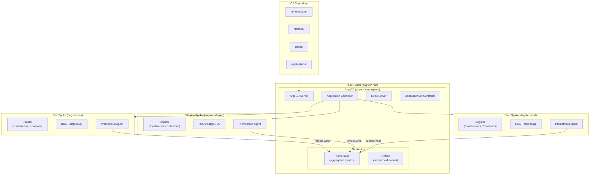

# Platform Architecture

## Overview

This platform implements a production-grade, multi-cluster data orchestration system using Dagster on AWS EKS, managed via ArgoCD hub-and-spoke GitOps architecture.

## System Architecture



## Deployment Layers

### Layer 0: Bootstrap (`bootstrap/terraform-backend/`)
- S3 bucket with KMS encryption for Terraform state
- Native S3 locking (Terraform 1.10+)
- Shared across all clusters

### Layer 1: Infrastructure (`infrastructure/`)
- **Shared** (`infrastructure/shared/`): Route53, ACM, Cognito, ECR, SNS, CloudWatch
- **Hub** (`infrastructure/hub/`): VPC, EKS cluster, IAM roles
- **Spokes** (`infrastructure/spokes/<env>/`): VPC, EKS, RDS PostgreSQL, IAM roles (IRSA) per environment
- Non-overlapping CIDRs per environment

### Layer 2: Platform (`platform/`)
- **Core** (`platform/core/`): ArgoCD, ALB Controller, External DNS, External Secrets, Metrics Server
- **Observability Hub** (`platform/observability/hub/`): Prometheus (aggregator), Grafana, Alertmanager
- **Observability Spoke** (`platform/observability/spoke/`): Prometheus Agent, Fluent Bit, OTEL Collector
- **Security** (`platform/security/`): Network policies, pod security, ExternalSecrets
- **Dagster** (`platform/dagster/`): Kustomize base + environment overlays

### Layer 3: Application (`applications/dagster-project/`)
- Dagster user code (Python package)
- Docker image built and pushed to ECR
- Shared image, different tags per environment

### Layer 4: GitOps (`gitops/`)
- **Infrastructure apps** (`gitops/infrastructure/`): App-of-apps, core-apps, observability-apps
- **Application apps** (`gitops/applications/<env>/`): Per-environment Dagster ArgoCD Application definitions
- Auto-sync for dev/staging, manual approval for prod

## Security Architecture

```
┌─────────────────────────────────────────────────┐
│                   AWS Account                    │
│                                                  │
│  ┌──────────────────────────────────────────┐   │
│  │           IAM (IRSA)                      │   │
│  │  ┌──────────────────────────────────┐    │   │
│  │  │ Per-cluster service account roles │    │   │
│  │  │ • ALB Controller                  │    │   │
│  │  │ • External Secrets                │    │   │
│  │  │ • External DNS                    │    │   │
│  │  │ • Fluent Bit                      │    │   │
│  │  │ • ADOT Collector                  │    │   │
│  │  └──────────────────────────────────┘    │   │
│  └──────────────────────────────────────────┘   │
│                                                  │
│  ┌──────────┐  ┌──────────┐  ┌──────────┐      │
│  │ Secrets  │  │ Cognito  │  │   KMS    │      │
│  │ Manager  │  │ User Pool│  │ (encrypt)│      │
│  └──────────┘  └──────────┘  └──────────┘      │
└─────────────────────────────────────────────────┘
```

- **No long-lived credentials**: All AWS access via IRSA
- **Secrets never in Git**: RDS credentials in Secrets Manager, synced via External Secrets
- **TLS everywhere**: ACM wildcard certificates, ALB terminates TLS
- **Authentication**: Cognito OAuth for Dagster UI and Grafana
- **Network isolation**: Each environment in its own VPC

## Monitoring Architecture

### Metrics Flow
```
Spoke clusters                    Hub cluster
┌─────────────┐                  ┌──────────────┐
│ Prometheus   │ ──remote-write──▶ │ Prometheus   │
│ Agent        │                  │ (aggregator) │
└─────────────┘                  └──────┬───────┘
                                        │
                                        ▼
                                 ┌──────────────┐
                                 │   Grafana    │
                                 │ (dashboards) │
                                 └──────────────┘
```

### Logs Flow
```
Each spoke cluster
┌─────────────┐     ┌──────────────────────────────┐
│ Fluent Bit  │ ──▶ │ CloudWatch Logs               │
│ (DaemonSet) │     │ /aws/eks/<cluster>/containers │
└─────────────┘     └──────────────┬───────────────┘
                                   │
                            ┌──────▼───────┐
                            │ Metric Filter│
                            │ (failures)   │
                            └──────┬───────┘
                                   │
                            ┌──────▼───────┐
                            │ CloudWatch   │
                            │ Alarm → SNS  │
                            └──────────────┘
```

### Traces Flow
```
Each spoke cluster
┌─────────────┐     ┌──────────────┐     ┌──────────┐
│ Dagster     │ ──▶ │ ADOT         │ ──▶ │ AWS      │
│ User Code   │     │ Collector    │     │ X-Ray    │
│ (OTLP/gRPC)│     │ (observabil.)│     │          │
└─────────────┘     └──────────────┘     └──────────┘
```

## CI/CD Architecture

```
Git Push → GitHub Actions (path-based detection)
                │
    ┌───────────┼───────────┬───────────┐
    ▼           ▼           ▼           ▼
 Terraform   Kustomize   Python     ArgoCD App
 validate    validate    lint+test   validate
                │
                ▼
         ArgoCD Sync (auto for dev/staging, manual for prod)
```

## Cost Model

The platform is designed for cost efficiency:

- **Hub cluster**: Minimal (t3.small spot) — only runs control plane
- **Dev**: Spot instances, minimal replicas, scales to zero when idle
- **Staging**: Spot instances, moderate replicas
- **Prod**: On-demand instances, HA configuration, resource quotas

Estimated total: ~$450/month for all four clusters including RDS and networking.
